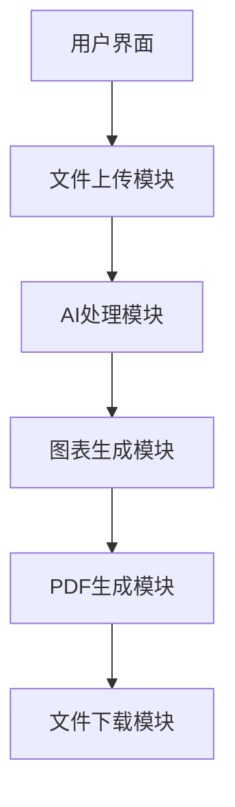

## Product Overview

学术论文漫画化Streamlit应用是一个单页应用，支持用户上传学术论文，通过AI处理生成漫画式讲解流程图和科普图表，最终输出PDF文件供下载。

## Core Features

- 论文文件上传功能（限制100MB）
- AI智能处理分析论文内容
- 生成漫画式讲解流程图
- 创建科普信息图表
- PDF文件生成和下载
- 吉卜力风格UI设计
- PC端适配

## Tech Stack

- **前端框架**: Streamlit (Python)
- **AI处理**: 集成AI API进行论文内容分析和可视化生成
- **PDF生成**: 使用reportlab或fpdf库
- **文件处理**: Python标准库处理文件上传
- **UI设计**: 自定义CSS实现吉卜力风格

## Architecture Design

### System Architecture



### Module Division

- **文件上传模块**: 处理PDF/DOCX文件上传，限制大小100MB
- **AI处理模块**: 调用AI API分析论文内容，提取关键信息
- **图表生成模块**: 基于AI分析结果生成漫画式流程图和科普图表
- **PDF生成模块**: 将生成的图表整合为PDF文件
- **UI模块**: 实现吉卜力风格的用户界面

### Data Flow


## Implementation Details

### Core Directory Structure

```
academic_manga_app/
├── app.py                 # 主应用文件
├── modules/
│   ├── file_handler.py    # 文件处理模块
│   ├── ai_processor.py    # AI处理模块
│   ├── chart_generator.py # 图表生成模块
│   └── pdf_creator.py     # PDF生成模块
├── assets/
│   ├── css/               # 自定义样式文件
│   └── images/            # 静态图片资源
├── utils/
│   └── helpers.py        # 辅助函数
└── requirements.txt       # 依赖包列表
```

### Key Code Structures

```python
# 主应用结构
class AcademicMangaApp:
    def __init__(self):
        self.setup_ui()
        self.setup_sessions()
    
    def setup_ui(self):
        # 设置吉卜力风格UI
        pass
    
    def process_paper(self, uploaded_file):
        # 处理上传的论文
        pass
    
    def generate_charts(self, analyzed_content):
        # 生成漫画图表
        pass
    
    def create_pdf(self, charts):
        # 创建PDF文件
        pass
```

### Technical Implementation Plan

1. **问题陈述**: 需要实现论文内容到可视化图表的转换
2. **解决方案**: 使用AI API进行内容分析，结合可视化库生成图表
3. **关键技术**: Streamlit、AI API、Matplotlib/Plotly、reportlab
4. **实现步骤**: 

- 搭建Streamlit基础框架
- 实现文件上传功能
- 集成AI处理API
- 开发图表生成功能
- 实现PDF生成和下载

5. **潜在挑战**: AI API调用的稳定性、大文件处理性能

### Integration Points

- 文件上传使用Streamlit的file_uploader组件
- AI处理通过HTTP API调用外部服务
- 图表生成使用Matplotlib/Plotly库
- PDF生成使用reportlab库
- UI样式通过自定义CSS实现吉卜力风格

## Technical Considerations

### Performance Optimization

- 文件大小限制避免服务器压力
- 异步处理AI请求避免阻塞用户界面
- 图表生成进度提示提升用户体验
- 缓存常用图表模板提高响应速度

### Security Measures

- 文件类型验证（仅允许PDF、DOCX）
- 文件大小限制100MB
- 上传文件安全扫描
- 用户数据隐私保护

### Scalability

- 模块化设计便于功能扩展
- 支持多种论文格式
- 可配置的图表样式
- 灵活的AI服务切换

### Development Workflow

- 使用Streamlit内置热重载进行开发
- 分模块实现和测试
- 版本控制使用Git
- 部署到云服务平台

## Design Style

采用吉卜力动画风格，打造柔软温馨的学术漫画化应用界面。使用暖色调、粗线条和圆润的设计元素，营造温暖舒适的学术氛围。整体布局信息饱满，通过分区设计展示完整的处理流程。

## Design Content Description

### 整体布局

采用垂直流动的单页布局，分为顶部标题区、文件上传区、处理进度区、结果展示区和下载区。使用柔和的渐变背景和手绘风格的装饰元素。

### 页面分区设计

1. **顶部标题区**: 使用圆润的手写字体，配合温暖的渐变色彩和简单的装饰图标
2. **文件上传区**: 设计为云朵形状的拖拽区域，使用柔和的阴影和动画效果
3. **处理进度区**: 采用动画进度条配合步骤指示器，每步都有可爱的图标
4. **结果展示区**: 卡片式布局展示生成的漫画图表，支持放大预览
5. **下载区**: 温馨的按钮设计，配合提示信息和动画效果

### 交互设计

- 按钮采用圆润设计，hover时有缩放和颜色变化效果
- 文件拖拽区域有动态边框动画
- 进度显示使用流动的动画效果
- 图表预览支持点击放大功能

### 响应式设计

专门针对PC端优化，使用固定宽度和居中布局，确保在大屏幕上的最佳视觉效果。

## Agent Extensions

### SubAgent

- **code-explorer** (from <subagent>)
- Purpose: 探索和分析现有项目代码结构
- Expected outcome: 了解当前项目的文件组织方式和代码结构，为新功能开发提供参考