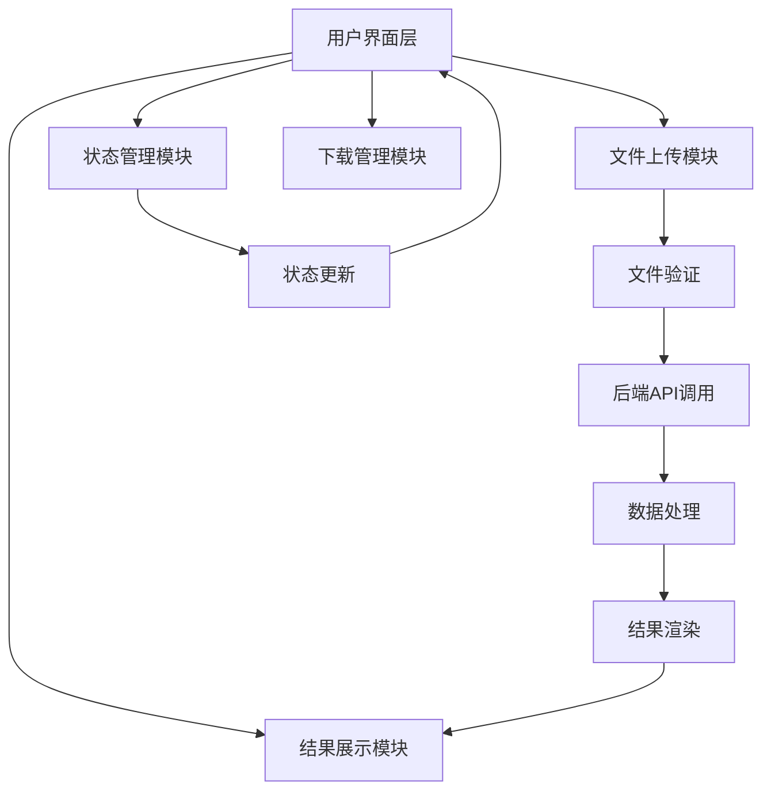

## Product Overview

学术论文漫画化前端应用是一个基于Streamlit的单页Web应用，用于将学术论文转换为漫画式的科普内容。用户可以上传PDF格式的学术论文，通过后端API进行AI处理，生成具有吉卜力风格的漫画式讲解流程图和科普图表。

## Core Features

- 文件上传模块：支持PDF格式论文上传，文件大小限制100MB
- 处理状态展示：实时显示AI处理进度和状态
- 结果展示区：以吉卜力风格展示生成的漫画式流程图和科普图表
- 下载功能：支持生成结果的批量下载
- 历史记录：保存用户的处理历史，支持查看和重新下载

## Tech Stack

- Frontend框架：Streamlit (Python)
- UI组件库：Streamlit原生组件 + 自定义CSS样式
- 文件处理：streamlit-file-uploader组件
- HTTP请求：requests库调用后端API
- 数据可视化：matplotlib和plotly用于结果展示
- 样式定制：CSS注入实现吉卜力风格UI

## Architecture Design



## Module Division

- **文件上传模块**：处理PDF文件上传，大小验证，格式检查
- **API通信模块**：与ChartGalaxy后端API交互，发送论文数据
- **状态管理模块**：跟踪处理进度，管理应用状态
- **结果展示模块**：渲染漫画式图表，实现吉卜力风格布局
- **下载功能模块**：处理文件下载，打包历史记录

## Data Flow


## Implementation Details

### Core Directory Structure

```
paper-manga-app/
├── app.py                 # 主应用入口
├── pages/
│   ├── __init__.py
│   └── home.py            # 主页面
├── components/
│   ├── __init__.py
│   ├── file_uploader.py   # 文件上传组件
│   ├── result_display.py  # 结果展示组件
│   └── status_tracker.py  # 状态跟踪组件
├── styles/
│   ├── ghibli.css        # 吉卜力风格样式
│   └── custom.css        # 自定义样式
├── utils/
│   ├── __init__.py
│   ├── api_client.py     # API通信工具
│   └── file_handler.py   # 文件处理工具
└── requirements.txt
```

### Key Code Structures

```python
# 主应用结构
class PaperMangaApp:
    def __init__(self):
        self.api_client = APIClient()
        self.state_manager = StateManager()
    
    def run(self):
        st.set_page_config(page_title="学术论文漫画化")
        self.setup_ghibli_style()
        self.render_main_interface()
    
    def setup_ghibli_style(self):
        # 注入吉卜力风格CSS
        pass
    
    def render_main_interface(self):
        # 渲染主界面
        pass

# API客户端
class APIClient:
    def upload_paper(self, file_data):
        # 上传论文到后端
        pass
    
    def get_processing_status(self, task_id):
        # 获取处理状态
        pass
    
    def download_results(self, result_id):
        # 下载处理结果
        pass
```

## Technical Implementation Plan

1. **文件上传限制实现**：使用Streamlit的file_uploader配置最大文件大小
2. **吉卜力风格UI**：通过CSS注入实现温暖的色彩方案和圆润的设计元素
3. **状态管理**：使用Streamlit session state跟踪处理进度
4. **API集成**：封装requests库实现与后端的通信
5. **结果展示优化**：使用多列布局和自定义组件展示丰富的内容

## Integration Points

- 后端API端点：/api/upload, /api/status, /api/results
- 数据格式：multipart/form-data用于文件上传，JSON用于状态查询
- 认证机制：如果需要，实现API key或token认证

## 设计风格

采用吉卜力工作室动画风格，创建温暖、柔和、圆润的用户界面。使用柔和的渐变色彩、圆润的边角、手绘风格的图标和装饰元素。整体色调以绿色、蓝色、棕色等自然色系为主，营造温馨舒适的学术氛围。

## 页面规划

1. **顶部导航区**：应用标题和简短介绍，吉卜力风格装饰
2. **文件上传区**：大型拖拽上传区域，带有动画效果
3. **处理状态区**：实时显示处理进度，使用动画图标
4. **结果展示区**：多列布局展示漫画式图表，支持缩放查看
5. **操作功能区**：下载按钮、历史记录查看等操作

## 交互设计

- 上传区域hover时有轻微浮动效果
- 处理状态使用流动的进度条动画
- 结果展示支持点击放大查看
- 所有按钮采用圆润设计，带有阴影效果

## Agent Extensions

### SubAgent

- **code-explorer**
- Purpose: 用于探索和搜索项目代码结构，特别是在需要查看多个文件或目录时
- Expected outcome: 快速定位和理解现有代码结构，为开发提供上下文信息