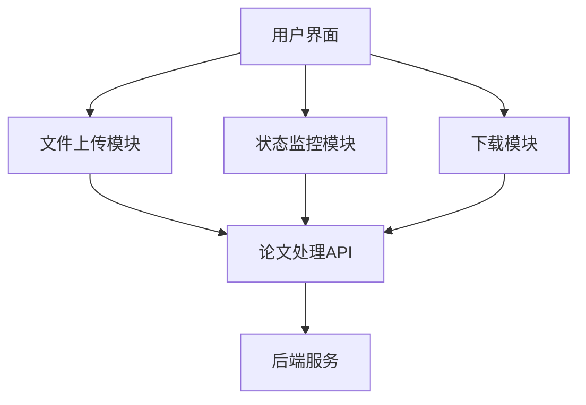
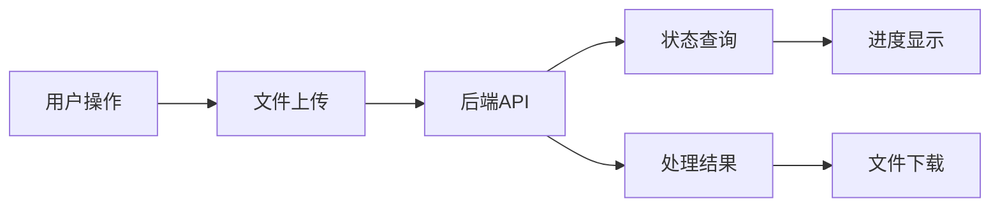

## Product Overview

基于Streamlit开发的学术论文解析前端应用，提供论文上传、AI处理状态跟踪、结果下载等核心功能，采用吉卜力风格UI设计。

## Core Features

- 论文文档上传功能（支持PDF格式）
- 处理进度实时查看（调用/api/status接口）
- 论文文字概要PDF下载
- 备选图表下载功能
- 单页应用设计，PC端优化
- 吉卜力风格UI界面

## Tech Stack

- **前端框架**: Streamlit (Python)
- **UI设计**: 自定义CSS实现吉卜力风格
- **文件处理**: streamlit.file_uploader
- **HTTP请求**: requests库
- **状态管理**: Streamlit会话状态
- **文件下载**: streamlit.download_button

## System Architecture

## Module Division

- **文件上传模块**: 处理PDF文件上传，调用后端API
- **状态监控模块**: 定期查询处理状态，显示进度信息
- **下载模块**: 提供处理结果下载功能
- **UI模块**: 吉卜力风格界面设计

## Data Flow

采用吉卜力动画风格的柔和配色和圆润设计，使用自定义CSS实现温馨自然的界面效果。整体布局简洁清晰，四个功能模块分区明确，使用柔和的渐变色和手绘风格的边框装饰。

## Agent Extensions

### SubAgent

- **code-explorer** (from <subagent>)
- Purpose: 探索项目文件结构和现有代码
- Expected outcome: 了解当前项目结构，为Streamlit应用开发做准备